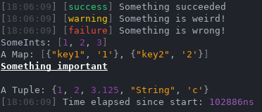

# Features
- Single header only
- Print colors and modifiers
- Print basic stl `Containers` <sub><sup>_(everything that has .begin() and .end())_</sup><sub>
- Print `Tuples` and `Pairs`
- Print basic chrono types
- Customizable

# Requirements
- C++17

# Compatibility
Should work on all terminals that support ansi escape codes.  
_(**Requires ENABLE_VIRTUAL_TERMINAL_PROCESSING on Windows**)_

# Installation
Drop `fancy.hpp` into your project.

# Preview


# Example
```cpp
// Printing STL containers
std::vector<int> someInts = {1, 2, 3};
fancy << "SomeInts: " << someInts << std::endl;

// Printing custom colors
fancy << Color{255,100,120}.foreground() << "Test" << std::endl;
fancy << Color{255,100,120}.background() << "Test" << std::endl;

// Printing modifiers
fancy << Color::underline() << Color::blinking() << "Test" << std::endl;

// Simple highlight
fancy >> "Something that gets highlighted" << std::endl;

// More examples can be found in "src/example.cpp"
```

# Customize
You can configure basic values [here](https://github.com/Curve/fancypp/blob/master/include/fancy.hpp#L58).